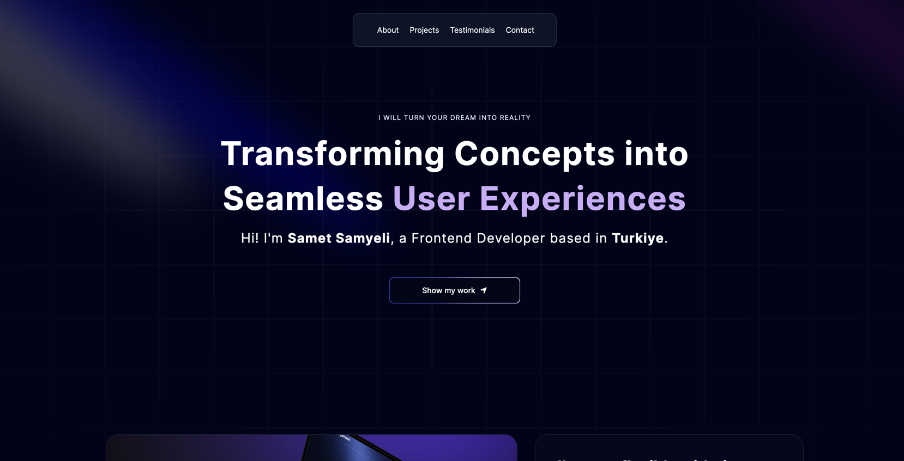
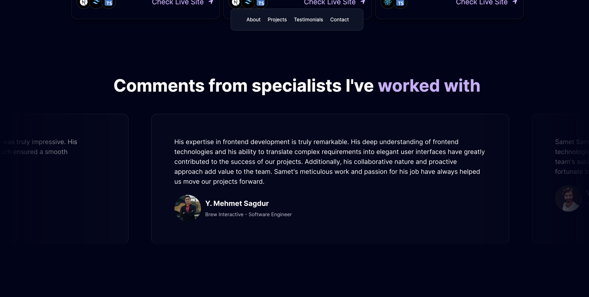
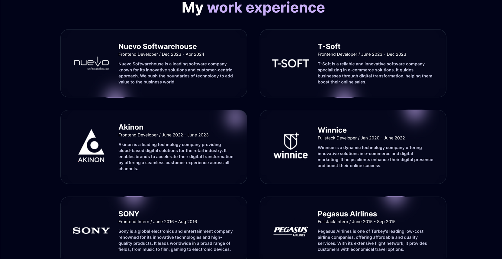

# Personal Portfolio Website

  

This project is my personal portfolio website, created to showcase my frontend development skills and introduce myself to potential employers or collaborators. The site includes information about me, the technologies I use, my projects, the services I offer, and feedback from people I have worked with. It also features a modern design and user experience principles.

  



## Contents

  

- [Technologies Used](#technologies-used)

- [Features](#features)

- [Installation](#installation)

- [Usage](#usage)

- [Contact](#contact)

  




## Technologies Used

  

The following technologies were used in this project:

  

-  **HTML**: Used to create the basic structure of the web page.

-  **CSS**: Used for styling and layout. Modern design principles (e.g., Bento Grid) were applied.

-  **TypeScript**: As a powerful subset of JavaScript, it allowed me to write more reliable and maintainable code.

-  **Next.js**: This React-based framework optimized site performance with SEO-friendly static site generation and server-side rendering features.

-  **aceternity ui**: Used as a customized UI library for user interface components.

-  **Framer Motion**: Utilized for page transitions and animations, enhancing the user experience.

-  **Sentry**: Employed for error tracking and performance monitoring, increasing site stability.

  

## Features

  

-  **Introduction**: Personal information and professional background.

-  **Tech Stack**: Technologies I use and the projects I've built with them.

-  **Projects**: Detailed introductions to my projects and sample works.

-  **Services**: A list and details of the services I provide.

-  **Feedback**: Thoughts and comments from people who have worked with me.

-  **Contact**: A contact form and social media links to reach me.

  

## Installation

  

To run this project locally, follow these steps:

  

1. Clone this repository:

```bash

git clone https://github.com/yourusername/portfolio.git
```

2. Navigate to the project directory:

```bash

cd portfolio
```

3. Install the necessary packages:

```bash

npm install
```

4. Start the development server:

```bash

npm run dev

```

  

## Usage

Once the development server is running, open http://localhost:3000 in your browser to view the project. The page will automatically reload when you make changes.

  

## Contact

For any questions or collaboration inquiries, feel free to reach out to me:

  

-  **Email**: ruzgarsamet@gmail.com

-  **LinkedIn**: linkedin.com/in/sametsamyeli

-  **Twitter**: twitter.com/sametsamyeli2

  

Thank you in advance for your feedback and contributions to this project!